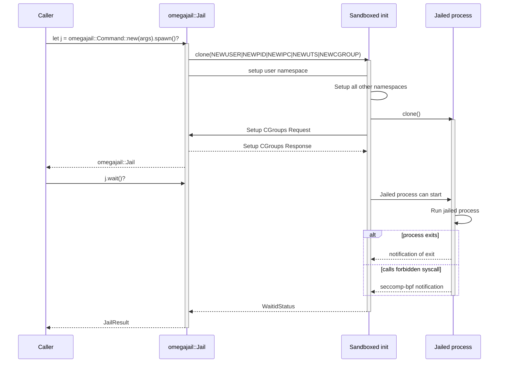

# omegajail

The omegaUp sandbox. Creates a userspace container with seccomp-bpf syscall
filtering in which the untrusted code is run.



## Example

```ignore
let args = omegajail::Args{
  // ...
};
let result = omegajail::jail::Command::new(args).spawn()?.wait()?;
println!("{:?}", result);
```
